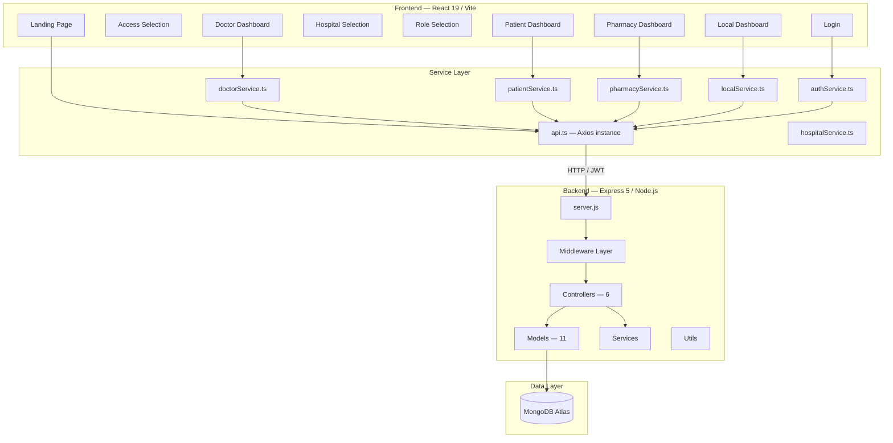
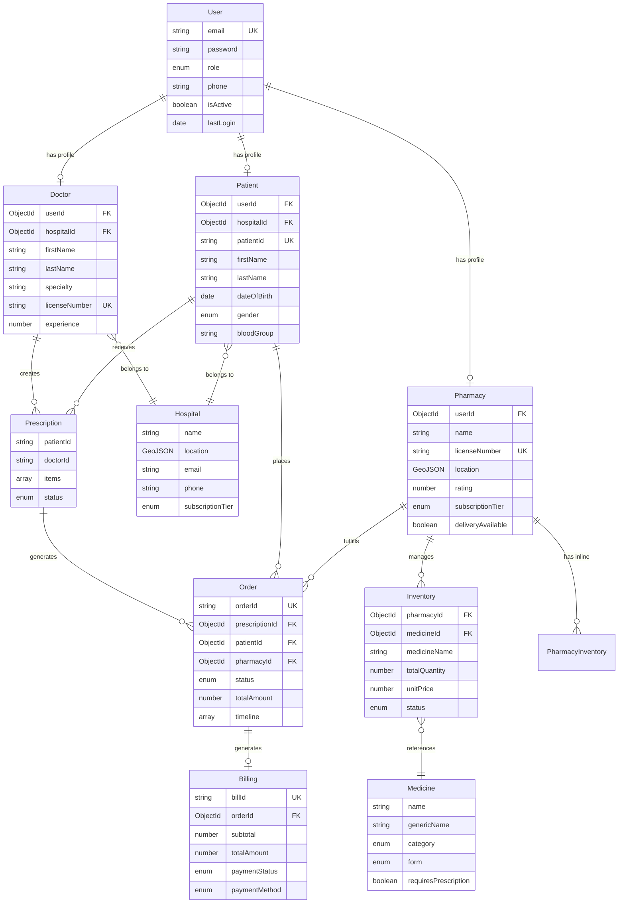
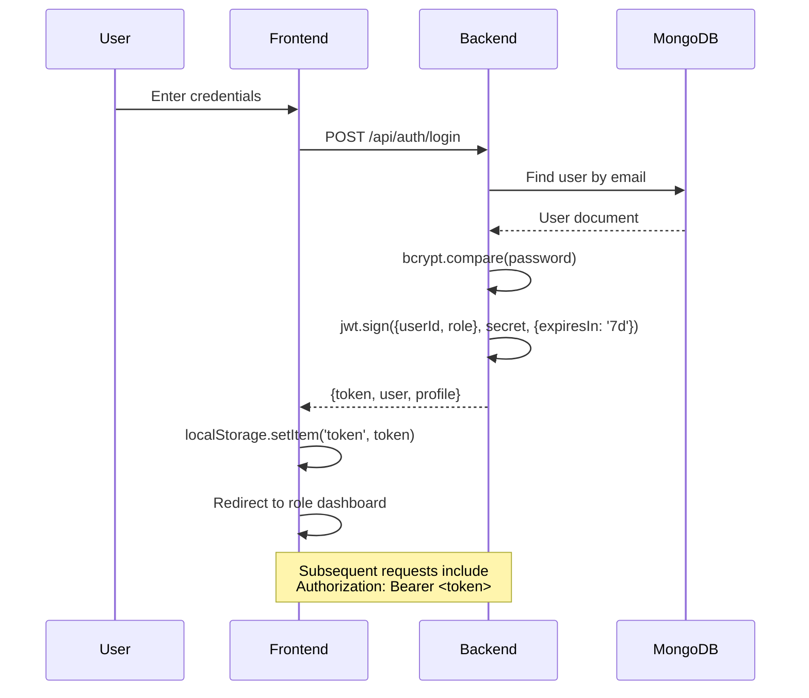
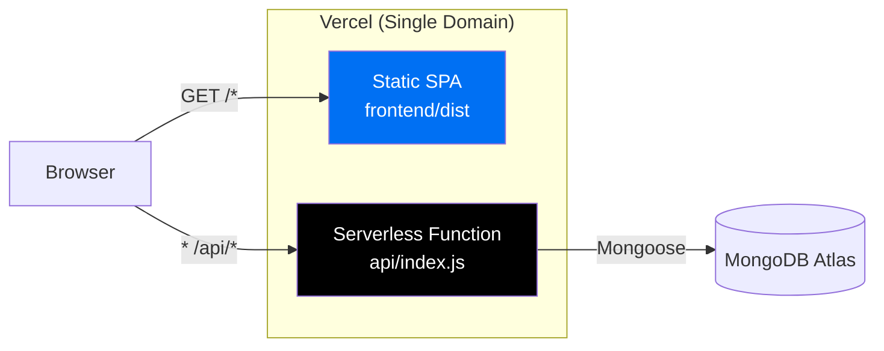

# MediSync — Comprehensive Project Analysis

## 1. Project Overview

**MediSync** is a full-stack digital healthcare platform that digitizes the prescription-to-fulfillment pipeline connecting **doctors**, **patients**, and **pharmacies**. It also supports **anonymous/local users** who can upload paper prescriptions and find nearby pharmacies — without creating an account.

| Dimension | Details |
|-----------|---------|
| **Frontend** | React 19 + TypeScript, Vite 6, Tailwind CSS 3, shadcn/ui, Motion |
| **Backend** | Node.js, Express 5.2, Mongoose 9.2 (MongoDB ODM) |
| **Database** | MongoDB (Atlas) with GeoJSON support |
| **Auth** | JWT (7-day expiry), bcrypt password hashing, RBAC |
| **Deployment** | Vercel monorepo (serverless functions + static SPA) |
| **Repo** | `Manideep667320/MediSync` on GitHub |

---

## 2. Architecture



### Layer Breakdown

| Layer | Count | Files |
|-------|-------|-------|
| **Backend Controllers** | 6 | [authController.js](file:///c:/Users/manid/Documents/Innovation/backend/controllers/authController.js), [doctorController.js](file:///c:/Users/manid/Documents/Innovation/backend/controllers/doctorController.js), [patientController.js](file:///c:/Users/manid/Documents/Innovation/backend/controllers/patientController.js), [pharmacyController.js](file:///c:/Users/manid/Documents/Innovation/backend/controllers/pharmacyController.js), [localController.js](file:///c:/Users/manid/Documents/Innovation/backend/controllers/localController.js), [hospitalController.js](file:///c:/Users/manid/Documents/Innovation/backend/controllers/hospitalController.js) |
| **Backend Models** | 11 | User, Doctor, Patient, Pharmacy, Hospital, Order, Prescription, Inventory, PharmacyInventory, Medicine, Billing |
| **Backend Middleware** | 5 | [auth.js](file:///c:/Users/manid/Documents/Innovation/backend/middleware/auth.js), [errorHandler.js](file:///c:/Users/manid/Documents/Innovation/backend/middleware/errorHandler.js), [rateLimiter.js](file:///c:/Users/manid/Documents/Innovation/backend/middleware/rateLimiter.js), [roleCheck.js](file:///c:/Users/manid/Documents/Innovation/backend/middleware/roleCheck.js), [upload.js](file:///c:/Users/manid/Documents/Innovation/backend/middleware/upload.js) |
| **Backend Services** | 1 | [prescriptionParser.js](file:///c:/Users/manid/Documents/Innovation/backend/services/prescriptionParser.js) — offline NLP engine |
| **Backend Utils** | 2 | [seeder.js](file:///c:/Users/manid/Documents/Innovation/backend/utils/seeder.js), [emailService.js](file:///c:/Users/manid/Documents/Innovation/backend/utils/emailService.js) |
| **Frontend Pages** | 10 | Landing, AccessSelection, LocalAuth, LocalDashboard, HospitalSelection, RoleSelection, Login, DoctorDashboard, PatientDashboard, PharmacyDashboard |
| **Frontend Services** | 7 | api, auth, doctor, patient, pharmacy, local, hospital |
| **Frontend Components** | 6 core + shadcn/ui + animate-ui libraries |

---

## 3. Database Schema (Entity Relationship)



---

## 4. API Endpoints Summary

| Domain | Method | Endpoint | Auth | Purpose |
|--------|--------|----------|------|---------|
| **Auth** | POST | `/api/auth/register` | ❌ | Register (doctor/patient/pharmacy) |
| | POST | `/api/auth/login` | ❌ | Login → JWT |
| | GET | `/api/auth/profile` | ✅ | Get current profile |
| **Doctor** | GET | `/api/doctor/dashboard` | ✅ Doctor | Dashboard stats |
| | POST | `/api/doctor/prescriptions` | ✅ Doctor | Create prescription |
| | GET | `/api/doctor/prescriptions` | ✅ Doctor | List prescriptions |
| | POST | `/api/doctor/prescriptions/:id/send` | ✅ Doctor | Send Rx to pharmacy |
| | GET | `/api/doctor/patients` | ✅ Doctor | Patient list |
| | GET | `/api/doctor/analytics` | ✅ Doctor | Analytics data |
| **Patient** | GET | `/api/patient/dashboard` | ✅ Patient | Dashboard |
| | GET | `/api/patient/prescriptions` | ✅ Patient | My prescriptions |
| | GET | `/api/patient/orders` | ✅ Patient | My orders |
| | GET | `/api/patient/orders/:id` | ✅ Patient | Track order |
| | GET | `/api/patient/bills` | ✅ Patient | Billing history |
| **Pharmacy** | GET | `/api/pharmacy/dashboard` | ✅ Pharmacy | Dashboard |
| | GET | `/api/pharmacy/orders` | ✅ Pharmacy | Incoming orders |
| | PUT | `/api/pharmacy/orders/:id` | ✅ Pharmacy | Update order status |
| | GET | `/api/pharmacy/inventory` | ✅ Pharmacy | View inventory |
| | PUT | `/api/pharmacy/inventory/:id` | ✅ Pharmacy | Update stock |
| | POST | `/api/pharmacy/inventory` | ✅ Pharmacy | Add medicine |
| **Local** | POST | `/api/local/upload-prescription` | ❌ | OCR upload (simulated) |
| | POST | `/api/local/pharmacies/nearby` | ❌ | Geospatial pharmacy search |
| **Hospital** | GET | `/api/hospitals` | ❌ | List hospitals |
| | GET | `/api/hospitals/:id` | ❌ | Hospital details |

---

## 5. Authentication & Security

### Auth Flow


### Security Measures Implemented

| Feature | Implementation | Status |
|---------|---------------|--------|
| Password hashing | bcrypt with salt rounds (10) | ✅ |
| JWT tokens | 7-day expiry, userId + role payload | ✅ |
| RBAC | Middleware-based role checking | ✅ |
| Rate limiting | 100 req/15min (API), 20 req/15min (auth) | ✅ |
| HTTP security headers | Helmet.js | ✅ |
| CORS | Restricted to `FRONTEND_URL` | ✅ |
| Input validation | Mongoose schema validators | ✅ |
| File upload limits | 10MB max via Multer | ✅ |
| Error sanitization | Stack traces hidden in production | ✅ |

---

## 6. Notable Technical Features

### 6.1 Prescription Parser (Offline NLP)
The [prescriptionParser.js](file:///c:/Users/manid/Documents/Innovation/backend/services/prescriptionParser.js) is an impressive **regex-based NLP engine** that runs entirely offline:

- Parses free-text lines like `"Paracetamol 500mg twice daily for 5 days"` into structured `{medicine, dosage, frequency, duration, instructions}`
- Supports Latin medical abbreviations (`OD`, `BD`, `TID`, `QID`, `SOS`, `PRN`, `STAT`)
- Handles voice transcription context extraction (patient name, age, diagnosis, symptoms)
- ~314 lines of well-structured parsing logic

### 6.2 Geospatial Pharmacy Search
- MongoDB 2dsphere index on Pharmacy and Hospital collections
- Haversine distance calculation for accurate km-based distances
- Results sorted by availability status first, then by distance

### 6.3 Custom Router (No React Router)
The frontend implements a [custom Router](file:///c:/Users/manid/Documents/Innovation/frontend/src/components/Router.tsx) using `window.history.pushState` and `popstate` events — avoiding the React Router dependency for most navigation. However, `react-router-dom` **is** still in `package.json` (possibly unused).

### 6.4 Order Lifecycle Tracking
Orders have a full state machine with timeline tracking:
```
prescription_sent → received_by_pharmacy → checking_stock → confirmed 
→ packing → ready_for_pickup → out_for_delivery → completed
```

### 6.5 AssemblyAI Integration
The `assemblyai` package is listed in dependencies — suggesting voice-to-text transcription capability for dictating prescriptions (used in doctor dashboard).

---

## 7. Code Quality & Issues Found

### 🔴 Critical Issues

| # | Issue | Location | Impact |
|---|-------|----------|--------|
| 1 | **Hardcoded JWT secret** in source code | [auth.js:4](file:///c:/Users/manid/Documents/Innovation/backend/middleware/auth.js#L4) — `'medisync-secret-key-change-in-production'` | Anyone reading the source can forge tokens if `JWT_SECRET` env var is not set |
| 2 | **Duplicate Inventory models** — `Inventory.js` and `PharmacyInventory.js` serve overlapping purposes | [Inventory.js](file:///c:/Users/manid/Documents/Innovation/backend/models/Inventory.js) vs [PharmacyInventory.js](file:///c:/Users/manid/Documents/Innovation/backend/models/PharmacyInventory.js) + inline `Pharmacy.inventory[]` | Data inconsistency; unclear which is source of truth |
| 3 | **Prescription model is skeletal** — only has `patientId: String, doctorId: String` (plain strings, not ObjectId refs) | [Prescription.js](file:///c:/Users/manid/Documents/Innovation/backend/models/Prescription.js) | Breaks relational integrity; `populate()` won't work; inconsistent with how the doctor controller builds prescriptions |
| 4 | **OCR is fully mocked** — always returns the same hardcoded data | [localController.js:15-41](file:///c:/Users/manid/Documents/Innovation/backend/controllers/localController.js#L15-L41) | Users uploading real prescriptions get fake data |
| 5 | **No token blacklisting** — logout is client-side only | [authController.js:241-253](file:///c:/Users/manid/Documents/Innovation/backend/controllers/authController.js#L241-L253) | Stolen tokens remain valid for 7 days |

### 🟡 Moderate Issues

| # | Issue | Location | Impact |
|---|-------|----------|--------|
| 6 | **Custom Router doesn't extract URL params** — `params` state is never populated despite being in context | [Router.tsx:13,30](file:///c:/Users/manid/Documents/Innovation/frontend/src/components/Router.tsx#L13-L30) | Dynamic routes like `/hospital/:hospitalId/role` can't access `hospitalId` via `useRouter()` |
| 7 | **`react-router-dom` in dependencies but using custom Router** | [frontend/package.json:23](file:///c:/Users/manid/Documents/Innovation/frontend/package.json#L23) | Unused ~40KB dependency bloating the bundle |
| 8 | **CORS origin allows only single origin** — no array support | [server.js:27](file:///c:/Users/manid/Documents/Innovation/backend/server.js#L27) | Breaks if frontend runs on different domains (e.g., staging + production) |
| 9 | **Order ID generation uses `countDocuments()`** — race condition under concurrent requests | [Order.js:94-98](file:///c:/Users/manid/Documents/Innovation/backend/models/Order.js#L94-L98) | Duplicate order IDs possible |
| 10 | **Frontend types use `snake_case` but backend returns `camelCase`** | [types/index.ts](file:///c:/Users/manid/Documents/Innovation/frontend/src/types/index.ts) vs [models/*](file:///c:/Users/manid/Documents/Innovation/backend/models) | Type mismatches; runtime `undefined` values |
| 11 | **No test suite exists** — `"test": "echo \"Error: no test specified\""` | [backend/package.json:10](file:///c:/Users/manid/Documents/Innovation/backend/package.json#L10) | No automated regression protection |
| 12 | **LocalDashboard.tsx is 67KB / ~2000+ lines** — single monolithic component | [LocalDashboard.tsx](file:///c:/Users/manid/Documents/Innovation/frontend/src/pages/LocalDashboard.tsx) | Unmaintainable; slow HMR; difficult to debug |
| 13 | **DoctorDashboard.tsx is 48KB** — another monolithic file | [DoctorDashboard.tsx](file:///c:/Users/manid/Documents/Innovation/frontend/src/pages/DoctorDashboard.tsx) | Same maintainability concerns |

### 🟢 Minor Issues / Improvement Opportunities

| # | Issue | Location |
|---|-------|----------|
| 14 | `estimatedTime` uses `Math.random()` — non-deterministic | [localController.js:137](file:///c:/Users/manid/Documents/Innovation/backend/controllers/localController.js#L137) |
| 15 | `notFound` middleware not used in serverless entry (`api/index.js`) | [api/index.js](file:///c:/Users/manid/Documents/Innovation/api/index.js) |
| 16 | Frontend `.env` committed to repo with `http://localhost:5000/api` | [frontend/.env](file:///c:/Users/manid/Documents/Innovation/frontend/.env) |
| 17 | Backend `.env` exists (potentially with real secrets) | Should be in `.gitignore` |
| 18 | `replace_colors.js` and `replace_colors_light.js` appear to be one-off scripts left in root | [replace_colors_light.js](file:///c:/Users/manid/Documents/Innovation/replace_colors_light.js) |
| 19 | `ProtectedRoute` calls `navigate()` during render — can cause React warnings | [ProtectedRoute.tsx:26](file:///c:/Users/manid/Documents/Innovation/frontend/src/components/ProtectedRoute.tsx#L26) |
| 20 | `useAuth` returns `profile: any` — loses type safety | [AuthContext.tsx:24](file:///c:/Users/manid/Documents/Innovation/frontend/src/context/AuthContext.tsx#L24) |

---

## 8. Deployment Architecture



The [vercel.json](file:///c:/Users/manid/Documents/Innovation/vercel.json) routes:
- `/api/*` → Serverless function at `api/index.js`
- Everything else → `index.html` (SPA fallback)

> [!WARNING]
> The serverless function at [api/index.js](file:///c:/Users/manid/Documents/Innovation/api/index.js) duplicates ~80% of [server.js](file:///c:/Users/manid/Documents/Innovation/backend/server.js). Changes to one must be manually mirrored in the other.

---

## 9. Dependency Analysis

### Backend Dependencies (13 packages)

| Package | Version | Purpose | Notes |
|---------|---------|---------|-------|
| express | ^5.2.1 | Web framework | ⚠️ Express 5 is still relatively new |
| mongoose | ^9.2.1 | MongoDB ODM | Latest major version |
| jsonwebtoken | ^9.0.3 | JWT auth | Standard |
| bcryptjs | ^3.0.3 | Password hashing | Pure JS implementation |
| helmet | ^7.2.0 | Security headers | ✅ Good practice |
| cors | ^2.8.6 | CORS middleware | Standard |
| morgan | ^1.10.1 | HTTP logging | Standard |
| multer | ^1.4.5-lts.1 | File uploads | LTS version |
| express-rate-limit | ^7.5.1 | Rate limiting | ✅ Good practice |
| dotenv | ^17.3.1 | Env vars | Standard |
| validator | ^13.15.26 | Input validation | Present but underutilized |
| nodemailer | ^8.0.4 | Email service | Configured but likely unused |
| **assemblyai** | ^4.26.1 | Voice-to-text | 🔑 Requires API key |

### Frontend Dependencies (14 packages)

| Package | Version | Purpose | Notes |
|---------|---------|---------|-------|
| react | ^19.2.4 | UI library | Latest |
| react-dom | ^19.2.4 | DOM rendering | Latest |
| typescript | ^5.9.3 | Type safety | Latest |
| vite | ^6.0.7 | Build tool | Latest |
| axios | ^1.13.5 | HTTP client | Standard |
| tailwindcss | ^3.4.17 | Styling | v3 (v4 available) |
| lucide-react | ^0.564.0 | Icons | Large icon set |
| motion | ^12.38.0 | Animations | Framer Motion successor |
| shadcn | ^4.0.8 | UI components | CLI tool |
| radix-ui | ^1.4.3 | Headless UI | For shadcn |
| react-router-dom | ^7.13.0 | Routing | ⚠️ Possibly unused (custom Router exists) |
| class-variance-authority | ^0.7.1 | Variant styling | For shadcn |
| tailwind-merge | ^3.5.0 | Class merging | For shadcn |
| tailwindcss-animate | ^1.0.7 | Animation utilities | Tailwind plugin |

---

## 10. File Size Analysis (Largest Files)

| File | Size | Concern |
|------|------|---------|
| [LocalDashboard.tsx](file:///c:/Users/manid/Documents/Innovation/frontend/src/pages/LocalDashboard.tsx) | 67.3 KB | 🔴 Massive — should be split into 5-8 sub-components |
| [Landing.tsx](file:///c:/Users/manid/Documents/Innovation/frontend/src/pages/Landing.tsx) | 56.8 KB | 🟡 Large but acceptable for a feature-rich landing page |
| [DoctorDashboard.tsx](file:///c:/Users/manid/Documents/Innovation/frontend/src/pages/DoctorDashboard.tsx) | 48.5 KB | 🔴 Should be decomposed into tab-specific components |
| [PharmacyDashboard.tsx](file:///c:/Users/manid/Documents/Innovation/frontend/src/pages/PharmacyDashboard.tsx) | 32.5 KB | 🟡 Moderate — could benefit from splitting |
| [PatientDashboard.tsx](file:///c:/Users/manid/Documents/Innovation/frontend/src/pages/PatientDashboard.tsx) | 26.0 KB | 🟡 Moderate |
| [sidebar.tsx](file:///c:/Users/manid/Documents/Innovation/frontend/src/components/ui/sidebar.tsx) | 21.7 KB | shadcn component — expected |
| [seeder.js](file:///c:/Users/manid/Documents/Innovation/backend/utils/seeder.js) | 17.0 KB | Acceptable for seed data |
| [index.css](file:///c:/Users/manid/Documents/Innovation/frontend/src/index.css) | 12.7 KB | Contains Tailwind directives + custom styles |
| [prescriptionParser.js](file:///c:/Users/manid/Documents/Innovation/backend/services/prescriptionParser.js) | 12.3 KB | Well-structured — acceptable |
| [pharmacyController.js](file:///c:/Users/manid/Documents/Innovation/backend/controllers/pharmacyController.js) | 12.8 KB | Moderate |

---

## 11. Strengths

1. **Comprehensive domain model** — The 11-model schema covers the full healthcare workflow end-to-end
2. **Well-designed security stack** — JWT + bcrypt + Helmet + CORS + rate limiting + RBAC is production-grade
3. **Offline prescription parser** — The NLP engine is clever and handles real medical abbreviations
4. **Geospatial queries** — Proper MongoDB 2dsphere indexes for pharmacy proximity search
5. **Order lifecycle** — Full state machine with timestamped timeline tracking
6. **Vercel monorepo deployment** — Single-domain setup eliminates CORS complexity
7. **Rich frontend** — Modern stack (React 19, Motion, shadcn/ui) with role-based dashboards
8. **Auto-generated IDs** — Order IDs (`ORD000001`) and Bill IDs (`BILL000001`) are user-friendly
9. **Good error handling** — Centralized error middleware covering Mongoose, JWT, Multer, and generic errors
10. **Clear documentation** — Detailed README, API docs, and deployment guide

---

## 12. Recommended Improvements (Prioritized)

### Priority 1 — Security & Data Integrity
- [ ] **Remove hardcoded JWT secret** fallback from source code
- [ ] **Add `.env` to `.gitignore`** if not already (backend `.env` may contain secrets)
- [ ] **Fix Prescription model** — Use `ObjectId` refs instead of plain strings
- [ ] **Consolidate inventory models** — Pick one source of truth (Inventory or PharmacyInventory or inline)
- [ ] **Add token blacklisting** or reduce token expiry significantly

### Priority 2 — Code Quality
- [ ] **Decompose monolithic dashboards** — Split LocalDashboard (67KB), DoctorDashboard (48KB) into sub-components
- [ ] **Fix Router params extraction** — The custom Router never populates `params` from URL patterns
- [ ] **Align frontend types with backend** — Fix snake_case vs camelCase mismatch
- [ ] **Remove unused `react-router-dom`** if custom Router is the intended solution
- [ ] **Fix concurrent order ID generation** — Use MongoDB auto-increment or UUID

### Priority 3 — Features & Polish
- [ ] **Implement real OCR** — Integrate Google Vision API or Tesseract.js instead of mock data
- [ ] **Add WebSocket/SSE** — Real-time order status updates instead of polling
- [ ] **Add test suite** — At minimum, unit tests for the prescription parser and auth flow
- [ ] **Add pagination** to all list endpoints
- [ ] **Clean up root scripts** — Move `replace_colors.js` and `replace_colors_light.js` to a tools/scripts folder

### Priority 4 — DevOps
- [ ] **Unify server.js and api/index.js** — Extract shared Express app setup to avoid drift
- [ ] **Add CI/CD pipeline** — GitHub Actions for linting, testing, and deploy previews
- [ ] **Add health check monitoring** — Uptime monitoring for the `/api/health` endpoint
- [ ] **Configure Vercel preview deployments** for PR reviews

---

## 13. Summary

MediSync is a **well-architected healthcare platform** with strong fundamentals — a comprehensive data model, proper security middleware, and an innovative offline prescription parser. The project is deployment-ready on Vercel with a clean monorepo setup.

The main areas needing attention are:

1. **Data model inconsistencies** (duplicate inventory models, skeletal Prescription schema)
2. **Frontend component decomposition** (several 30-67KB monolithic page files)
3. **Custom Router limitations** (doesn't extract URL params)
4. **Mock OCR** needs real implementation for production use
5. **No test coverage** across the entire codebase

The codebase is at a solid **MVP stage** and would benefit most from consolidating the data layer and adding tests before expanding features.
